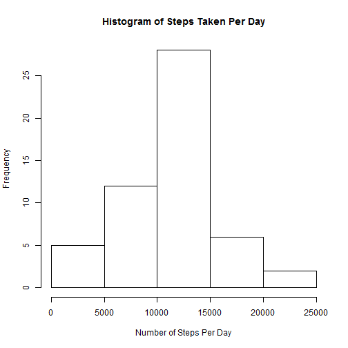

## Loading and preprocessing the data
### Load the data (i.e. read.csv())

```r
activity <- read.csv(unzip("activity.zip"))
```

### Process/transform the data (if necessary) into a format suitable for your analysis 
Convert date to Date format

```r
activity$date <- as.Date(activity$date, "%Y-%m-%d")
```

## What is mean total number of steps taken per day?
### Calculate the total number of steps taken per day

```r
stepsPerDay <- aggregate(steps ~ date, data = activity, sum)
print(stepsPerDay)
```

```
##          date steps
## 1  2012-10-02   126
## 2  2012-10-03 11352
## 3  2012-10-04 12116
## 4  2012-10-05 13294
## 5  2012-10-06 15420
## 6  2012-10-07 11015
## 7  2012-10-09 12811
## 8  2012-10-10  9900
## 9  2012-10-11 10304
## 10 2012-10-12 17382
## 11 2012-10-13 12426
## 12 2012-10-14 15098
## 13 2012-10-15 10139
## 14 2012-10-16 15084
## 15 2012-10-17 13452
## 16 2012-10-18 10056
## 17 2012-10-19 11829
## 18 2012-10-20 10395
## 19 2012-10-21  8821
## 20 2012-10-22 13460
## 21 2012-10-23  8918
## 22 2012-10-24  8355
## 23 2012-10-25  2492
## 24 2012-10-26  6778
## 25 2012-10-27 10119
## 26 2012-10-28 11458
## 27 2012-10-29  5018
## 28 2012-10-30  9819
## 29 2012-10-31 15414
## 30 2012-11-02 10600
## 31 2012-11-03 10571
## 32 2012-11-05 10439
## 33 2012-11-06  8334
## 34 2012-11-07 12883
## 35 2012-11-08  3219
## 36 2012-11-11 12608
## 37 2012-11-12 10765
## 38 2012-11-13  7336
## 39 2012-11-15    41
## 40 2012-11-16  5441
## 41 2012-11-17 14339
## 42 2012-11-18 15110
## 43 2012-11-19  8841
## 44 2012-11-20  4472
## 45 2012-11-21 12787
## 46 2012-11-22 20427
## 47 2012-11-23 21194
## 48 2012-11-24 14478
## 49 2012-11-25 11834
## 50 2012-11-26 11162
## 51 2012-11-27 13646
## 52 2012-11-28 10183
## 53 2012-11-29  7047
```

### If you do not understand the difference between a histogram and a barplot, research the difference between them. Make a histogram of the total number of steps taken each day

```r
hist(stepsPerDay$steps, main="Histogram of Steps Taken Per Day", xlab="Number of Steps Per Day")
```

 

### Calculate and report the mean and median of the total number of steps taken per day

```r
mean(stepsPerDay$steps)
```

```
## [1] 10766.19
```

```r
median(stepsPerDay$steps)
```

```
## [1] 10765
```


## What is the average daily activity pattern?
### Make a time series plot (i.e. type = "l") of the 5-minute interval (x-axis) and the average number of steps taken, averaged across all days (y-axis)

```r
stepsPerInterval <- aggregate(steps ~ interval, data = activity, mean)
with(stepsPerInterval, plot(interval, steps, type = "l",
	main = "Average No. of Steps of Each Interval",
	xlab = "Interval",
	ylab = "Average number of steps"))
```

 
### Which 5-minute interval, on average across all the days in the dataset, contains the maximum number of steps?

```r
stepsPerInterval$interval[which.max(stepsPerInterval$steps)]
```

```
## [1] 835
```

## Imputing missing values
### Calculate and report the total number of missing values in the dataset (i.e. the total number of rows with NAs)

```r
naVector <- !complete.cases(activity)
sum(naVector)
```

```
## [1] 2304
```

### Devise a strategy for filling in all of the missing values in the dataset. The strategy does not need to be sophisticated. For example, you could use the mean/median for that day, or the mean for that 5-minute interval, etc.
I will fill in the missing values with the mean for that 5-minute interval.  
Because there are 61 days in the dataset, I can duplicate the stepsPerInterval dataframe, which has the average for each interval, 61 times and get the same dimension as the activity dataframe.  
From there, the steps for each interval will line up with its average. Then if the steps is NA, I will copy over the average to impute the NA.  

```r
df <- data.frame()
for (n in 1:61)
	df <- rbind(df, stepsPerInterval)
imputSteps <- activity$steps
imputSteps[naVector] <- df$steps[naVector]
```

### Create a new dataset that is equal to the original dataset but with the missing data filled in.

```r
imputActivity <- activity
imputActivity$steps <- imputSteps
```

### Make a histogram of the total number of steps taken each day and Calculate and report the mean and median total number of steps taken per day. Do these values differ from the estimates from the first part of the assignment? What is the impact of imputing missing data on the estimates of the total daily number of steps?

```r
stepsPerDay <- aggregate(steps ~ date, data = imputActivity, sum)
hist(stepsPerDay$steps, main="Histogram of Steps Taken Per Day", xlab="Number of Steps Per Day")
```

 

```r
mean(stepsPerDay$steps)
```

```
## [1] 10766.19
```

```r
median(stepsPerDay$steps)
```

```
## [1] 10766.19
```
The mean is not affected as we all more averages into data when increasing the number of data.  
The median is now the same as the average, as more averages is added to the data which is in the middle.   

## Are there differences in activity patterns between weekdays and weekends?
### Create a new factor variable in the dataset with two levels – “weekday” and “weekend” indicating whether a given date is a weekday or weekend day.

```r
imputActivity$day <- ifelse((weekdays(imputActivity$date) == "Saturday" |
	 weekdays(imputActivity$date) == "Sunday"), "weekend", "weekday")
```

### Make a panel plot containing a time series plot (i.e. type = "l") of the 5-minute interval (x-axis) and the average number of steps taken, averaged across all weekday days or weekend days (y-axis). See the README file in the GitHub repository to see an example of what this plot should look like using simulated data.

```r
aggActivity <- aggregate(steps ~ interval + day, data = imputActivity, mean)
library(lattice)
xyplot(steps ~ interval|day, data = aggActivity, layout=c(1,2),
	xlab="Interval", ylab="Number of steps", type="l")
```

 
